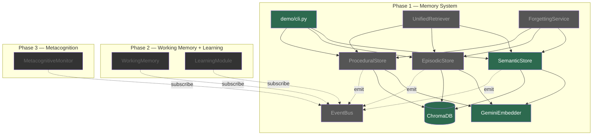
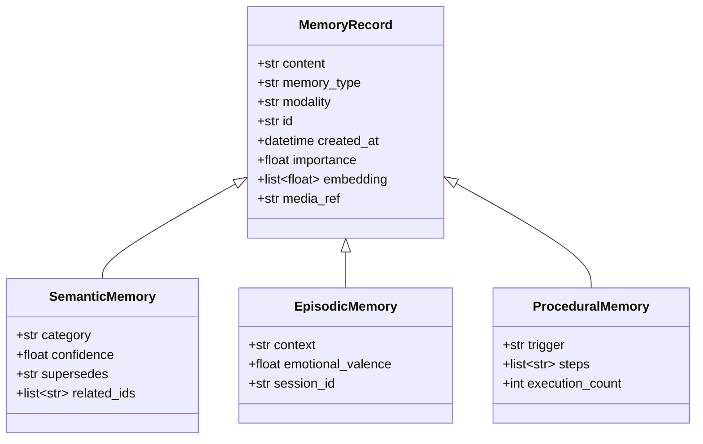
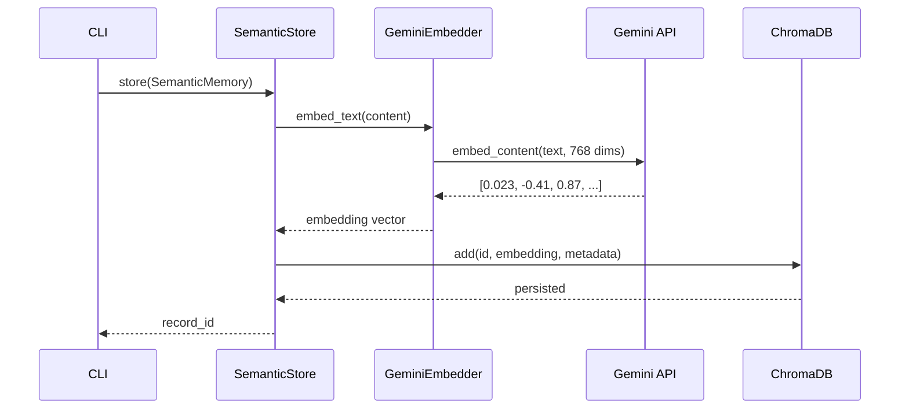
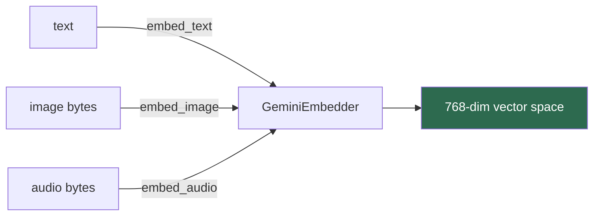
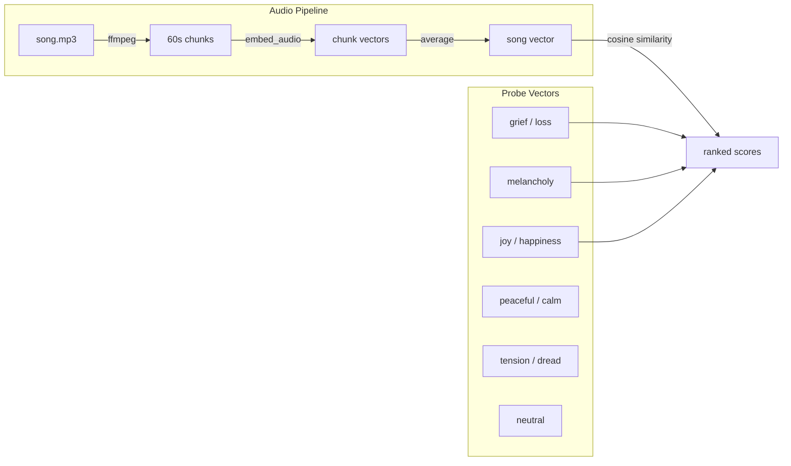

# agentic-memory

A cognitive memory system for AI agents, grounded in the taxonomy from [Measuring Progress Toward AGI: A Cognitive Framework](research-docs/measuring-progress-toward-agi-a-cognitive-framework.pdf).

Most agent frameworks treat memory as a single vector store you dump context into. This project implements memory the way the cognitive science paper describes it: **separate stores for different memory types**, a **unified retriever** that queries across them, a **forgetting service** that prunes stale knowledge, and an **event bus** that lets future modules (working memory, learning, metacognition) subscribe without touching core code.

Built on **Gemini Embedding 2** for natively multimodal embeddings — text, images, audio, and video share a single vector space.

> Status: Phase 1 in progress. Semantic memory write path is functional. Read path and event bus next.

---

## Architecture



Green = built. Grey = planned (Phase 1). Dark = future phases.

---

## Memory Types

The paper identifies distinct memory sub-types that behave differently — different decay rates, retrieval patterns, and update semantics. This project implements them as separate ChromaDB collections behind a shared interface.



---

## Write Path

How a memory goes from raw content to a persisted vector:



---

## Multimodal Embeddings

All modalities go through the same `GeminiEmbedder` and land in the same vector space. A text query can retrieve an image memory. An audio clip can be compared to text descriptions.



The embedding model is [Gemini Embedding 2](https://ai.google.dev/gemini-api/docs/embeddings) — natively multimodal, mapping text, images, audio, and video into a single embedding space. Matryoshka support allows truncation from 3072 down to 768 dimensions with minimal accuracy loss.

---

## Experiment: Cross-Modal Emotion in Audio

We ran an experiment to test whether audio embeddings encode emotional tone or just acoustic structure. Four songs across three languages (English, Hindi, Arabic), embedded as raw bytes with no metadata passed to the model.



**Results summary:**

| Song | Genre | Language | Top Match | Runner-up |
|---|---|---|---|---|
| Schindler's List Theme | Orchestral | Instrumental | melancholy (0.70) | grief (0.68) |
| Phir Se | Bollywood | Hindi | grief (0.69) | melancholy (0.69) |
| Rasputin | Disco-pop | English | joy (0.69) | tension (0.67) |
| Didi | Rai | Arabic/French | joy (0.66) | melancholy (0.63) |

The model correctly separated sad from happy songs, made nuanced distinctions within each cluster (melancholy vs. grief, joy vs. tension), and worked cross-lingually on raw audio bytes with no transcription.

Grief ranked last on both happy songs. Neutral ranked last on both sad songs. The largest winner-to-loser gap was 0.087 (Phir Se: grief vs. neutral).

Full methodology and analysis: [`experiments/audio_emotion_probe_results.md`](experiments/audio_emotion_probe_results.md)

**Architectural implication:** `emotional_valence` on episodic memories can be derived directly from the embedding — no separate sentiment analysis pipeline needed.

---

## Project Structure

```
agentic-memory/
├── config.py                  # API keys, model config, ChromaDB path
├── models/
│   ├── base.py                # MemoryRecord dataclass
│   └── semantic.py            # SemanticMemory (factual knowledge)
├── utils/
│   └── embeddings.py          # GeminiEmbedder — text, image, audio
├── stores/
│   ├── base.py                # Abstract BaseStore interface
│   └── semantic_store.py      # ChromaDB-backed semantic store
├── retrieval/                  # (planned) Unified cross-store retriever
├── events/                     # (planned) Event bus for store/retrieve signals
├── demo/
│   └── cli.py                 # CLI for storing and querying memories
├── experiments/
│   ├── audio_emotion_probe.py           # Cross-modal emotion probe script
│   └── audio_emotion_probe_results.md   # Full results and analysis
├── media/                      # Audio/image files (not committed)
└── research-docs/
    └── measuring-progress-toward-agi-a-cognitive-framework.pdf
```

---

## Setup

```bash
python3 -m venv .venv
source .venv/bin/activate
pip install -r requirements.txt
```

Create a `.env` file:
```
GEMINI_API_KEY=your_key_here
```

System dependency for audio chunking:
```bash
# arch
sudo pacman -S ffmpeg

# ubuntu/debian
sudo apt install ffmpeg
```

---

## Usage

Store a fact:
```bash
python demo/cli.py store "Python was created by Guido van Rossum"
```

Run the audio emotion probe:
```bash
python experiments/audio_emotion_probe.py "song.mp3"
```

---

## Offline Evaluation

The repo now includes a deterministic offline episodic-memory evaluation harness
for fixed synthetic fixtures across mixed-store retrieval, temporal recall,
session reconstruction, recent-event lookup, and cross-modal media-backed
episodes.

Run it with:

```bash
pytest tests/test_offline_episodic_eval.py
```

or:

```bash
python tests/test_offline_episodic_eval.py
```

Benchmark mapping and rationale: [`docs/offline_episodic_eval.md`](docs/offline_episodic_eval.md)

---

## Theoretical Foundation

This project is built on the cognitive taxonomy from the DeepMind paper *Measuring Progress Toward AGI*. The paper distinguishes three faculties that most agent frameworks conflate:

- **Memory** — passive storage and retrieval (semantic facts, episodic events, procedural skills)
- **Working Memory** — active manipulation of information for a current goal (sits under Executive Functions, not Memory)
- **Learning** — acquisition and consolidation of new knowledge into long-term memory

The architecture implements these as separate systems. Phase 1 builds the memory stores. Phase 2 adds working memory (an active scratchpad) and a learning module (consolidation from working memory to long-term stores). Phase 3 adds metacognitive monitoring — the system's ability to assess confidence in its own retrieved context.

---

## License

MIT
